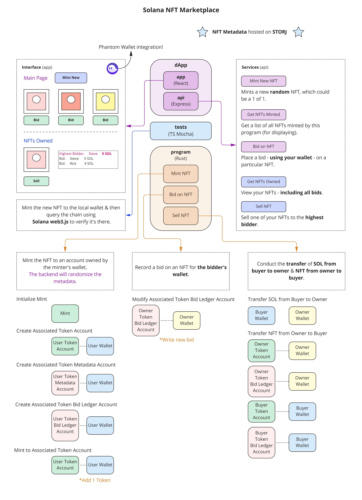

# NFT Marketplace

## How it Works


## Development Setup

### Node JS, NPM, & Yarn
Install `nodejs` & `npm` using the recommended method for your operating system. For many Linux distributions - including WSL2 on Windows - it's recommended to use [nvm](https://docs.microsoft.com/en-us/windows/dev-environment/javascript/nodejs-on-wsl).   
   
Next, install `yarn`:
```shell
npm install -g yarn
```

### Rust
Install `rust`, `cargo`, and many other required libraries:
```shell
curl https://sh.rustup.rs -sSf | sh
```
>[!NOTE]
> This is for Linux & MacOS. For **Windows**, check out the [original site](https://doc.rust-lang.org/cargo/getting-started/installation.html).

### Solana
```shell
sh -c "$(curl -sSfL https://release.solana.com/v1.10.25/install)"
```
>[!NOTE]
> This is for Linux & MacOS. For **Windows**, check out the [original site](https://docs.solana.com/cli/install-solana-cli-tools).

### Anchor CLI
```shell
npm install -g @project-serum/anchor-cli
```

### Candy Machine
Ensure you have `yarn` installed. Install the Metaplex CLI:
```shell
git clone https://github.com/metaplex-foundation/metaplex.git ~/metaplex
yarn install --cwd ~/metaplex/js/
```
Verify it was installed correctly:
```shell
ts-node ~/metaplex/js/packages/cli/src/candy-machine-v2-cli.ts --version
```

## Using this Repository
### Run client
```shell
anchor run test
```
OR
```shell
docker-compose up
```
### Deploy Program
```shell
anchor build
anchor deploy
```
OR
```shell
docker-compose run program "anchor build && anchor deploy"
```

## Working with an Imported IDL
If you're using the [Solana Playground IDE](https://beta.solpg.io), you can import your Solana program's IDL by building it, selecting `Extra -> IDL` from the drop-down, clicking `Export`, then dropping your json file in the `solpg` folder.   
   
Then just un-comment the necessary code in either `api/src/service.ts` or `tests/nft-marketplace.ts`.